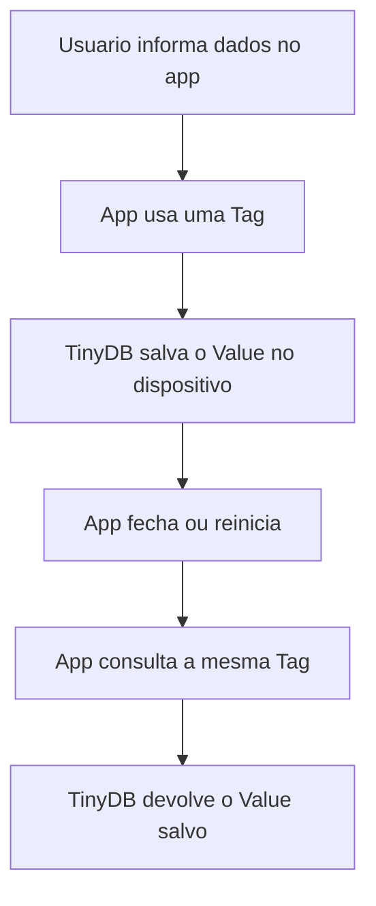

# Pesquisa - App Inventor e TinyDB

**Integrantes:** Laura Cristina Gonçalves da Cruz, Otávio Giovanelli Biazzi, Pedro Henrique Miranda e Pedro Henrique Dalle Molle Godoi
**Série:** 2D  
**Curso:** Técnico em Informática Para Internet  
**Tema:** App Inventor: manipulação de banco de dados no dispositivo com TinyDB

## 1. O que é o MIT App Inventor?

O MIT App Inventor é uma plataforma gratuita de desenvolvimento de aplicativos, criada para permitir que pessoas iniciantes construam apps por meio de programação visual em blocos. Em vez de escrever todo o código manualmente, o usuário monta a interface do aplicativo e depois conecta blocos lógicos que representam ações, eventos, variáveis e comandos (MIT APP INVENTOR, 2025).

Ele é utilizado principalmente para criar aplicativos Android, fazer protótipos, aprender lógica de programação e desenvolver projetos educacionais. Por ser visual, o App Inventor facilita o entendimento da relação entre interface e comportamento do programa, algo importante para quem ainda está começando em programação.

Entre suas principais vantagens para iniciantes estão:

- ambiente visual, com menos necessidade de digitar código;
- blocos de programação que ajudam a evitar erros de sintaxe;
- possibilidade de testar o aplicativo no celular;
- foco em lógica, eventos e componentes;
- uso em projetos escolares e protótipos rápidos;
- documentação oficial com exemplos e componentes prontos.

Segundo materiais educacionais brasileiros sobre App Inventor, como os do IFSC, a ferramenta é adequada para introduzir conceitos de programação por meio da criação de aplicativos móveis e interação com componentes visuais (IFSC, 2012a). Esse tipo de abordagem também aparece em propostas educacionais brasileiras voltadas ao ensino de pensamento computacional e desenvolvimento de apps (THOMAS; CAMBRAIA, 2023).

## 2. O que é o TinyDB?

O TinyDB é um componente de armazenamento do MIT App Inventor. Ele serve para salvar dados diretamente no dispositivo em que o aplicativo está instalado, permitindo que essas informações continuem disponíveis mesmo depois que o app é fechado e aberto novamente (MIT APP INVENTOR, 2024a).

Sua finalidade é guardar informações simples do aplicativo, como nomes, listas, configurações, pontuações, cadastros pequenos e preferências do usuário. Os dados são armazenados localmente no próprio aparelho, e não em um servidor na Internet.

O funcionamento do TinyDB é baseado em pares de **Tag** e **Value**:

- **Tag:** nome usado como chave para identificar uma informação;
- **Value:** valor salvo naquela chave, podendo ser texto, número, lista ou outro dado aceito pelo App Inventor.

### Vantagens

- funciona sem Internet;
- é simples de usar;
- mantém os dados salvos no dispositivo;
- é útil para aplicativos pequenos e médios;
- permite salvar listas e valores com poucos blocos.

### Limitações

- os dados ficam apenas no dispositivo;
- não é indicado para compartilhamento de dados entre vários usuários;
- se o aplicativo for removido ou os dados forem apagados, as informações podem ser perdidas;
- não substitui um banco de dados completo;
- exige cuidado na organização das Tags para evitar confusão.

## 3. Funcionamento do TinyDB

O TinyDB trabalha como um pequeno banco de dados local dentro do aplicativo. Para salvar uma informação, o programador escolhe uma Tag e associa a ela um valor. Depois, para recuperar essa informação, usa a mesma Tag. Se o valor de uma Tag for gravado novamente, o valor antigo é substituído pelo novo.



### Tags ou chaves

As Tags funcionam como nomes de identificação. Por exemplo, em um aplicativo de tarefas, a Tag `lista_tarefas` pode guardar todas as tarefas cadastradas pelo usuário.

Exemplo:

```text
Tag: lista_tarefas
Value: ["Estudar TinyDB", "Fazer atividade", "Enviar no Teams"]
```

### Valores

O Value é o conteúdo salvo na Tag. Ele pode ser um texto, número, lista ou outro tipo de dado simples. Por exemplo:

```text
Tag: nome_usuario
Value: "Otavio"
```

```text
Tag: pontuacao
Value: 150
```

### Gravação de informações

Para gravar informações, usa-se o bloco **StoreValue**. O programador informa a Tag e o valor que será armazenado.

Exemplo:

```text
TinyDB.StoreValue
tag = "nome_usuario"
valueToStore = CampoNome.Text
```

Nesse caso, o conteúdo digitado pelo usuário no campo de texto é salvo no dispositivo.

### Leitura de informações

Para ler dados salvos, usa-se o bloco **GetValue**. O aplicativo procura a Tag informada e retorna o valor salvo. Caso não exista nenhum valor para aquela Tag, pode ser usado um valor padrão.

Exemplo:

```text
nome = TinyDB.GetValue
tag = "nome_usuario"
valueIfTagNotThere = "Sem nome cadastrado"
```

### Atualização de dados

Para atualizar um dado, basta usar novamente **StoreValue** com a mesma Tag. O novo valor substitui o valor anterior.

Exemplo:

```text
TinyDB.StoreValue
tag = "pontuacao"
valueToStore = 200
```

Se antes a Tag `pontuacao` guardava `150`, depois da atualização ela passará a guardar `200`.

### Remoção de dados

Para remover uma informação específica, usa-se **ClearTag**. Para apagar todos os dados salvos pelo TinyDB naquele aplicativo, usa-se **ClearAll** (MIT APP INVENTOR, 2024a).

## 4. Componentes relacionados

Os principais blocos usados com o TinyDB são:

| Bloco | Função | Quando usar |
|---|---|---|
| `StoreValue` | Salva um valor em uma Tag. | Quando o aplicativo precisa guardar uma informação. |
| `GetValue` | Recupera o valor salvo em uma Tag. | Quando o app precisa mostrar ou reutilizar dados armazenados. |
| `ClearTag` | Apaga apenas uma Tag específica. | Quando o usuário remove uma informação, como uma tarefa ou contato. |
| `ClearAll` | Apaga todos os dados salvos pelo TinyDB no app. | Quando o aplicativo precisa limpar todos os registros ou restaurar dados. |
| `GetTags` | Retorna uma lista com as Tags existentes. | Quando o app precisa listar os registros salvos. |

Esses blocos permitem criar sistemas simples de cadastro e consulta sem precisar de servidor. A documentação oficial do MIT App Inventor apresenta o TinyDB como parte dos componentes de armazenamento, junto com outras opções como File, CloudDB e TinyWebDB (MIT APP INVENTOR, 2024a).

## 5. Aplicações práticas

O TinyDB é adequado para aplicativos que precisam guardar dados simples no próprio celular. Ele funciona bem quando o objetivo é manter informações locais, sem exigir login, servidor ou conexão com a Internet.

Em uma atividade prática do IFSC sobre App Inventor, o TinyDB é apresentado como um componente capaz de armazenar dados de forma persistente no telefone, o que reforça seu uso em aplicações locais e individuais (IFSC, 2012b).

### Lista de tarefas

Em uma lista de tarefas, o TinyDB pode salvar uma lista com os itens cadastrados pelo usuário. Quando o app for aberto novamente, a lista pode ser carregada e exibida na tela.

### Agenda de contatos

Em uma agenda simples, cada contato pode ser salvo in uma lista ou em Tags separadas. Para projetos escolares e protótipos, isso permite criar um cadastro funcional sem usar banco externo.

### Cadastro de clientes

Um pequeno cadastro de clientes pode usar o TinyDB para guardar nome, telefone, e-mail e observações. É uma solução adequada para demonstrações, protótipos e aplicativos de uso individual.

### Lista de compras

O TinyDB pode salvar os produtos adicionados pelo usuário, mantendo a lista disponível mesmo depois que o app é fechado.

### Aplicativo de anotações

Um app de anotações pode guardar textos digitados pelo usuário em Tags diferentes, como `nota_1`, `nota_2` ou uma lista chamada `minhas_notas`.

### Controle financeiro

Em um controle financeiro simples, o TinyDB pode armazenar receitas, despesas e saldo. Porém, se o app precisar sincronizar dados entre celulares ou fazer backup online, outra solução será mais adequada.

### Jogos com armazenamento de pontuações

Jogos simples podem usar o TinyDB para salvar recordes, fases liberadas e configurações do jogador. Esse é um uso comum, pois a informação precisa continuar salva no aparelho depois que o jogo fecha.

## 6. TinyDB x TinyWebDB

O TinyDB e o TinyWebDB têm a função de armazenar dados, mas são usados em situações diferentes. A diferença principal está no local onde os dados ficam salvos.

| Característica | TinyDB | TinyWebDB |
|---|---|---|
| Local dos dados | No próprio dispositivo. | Em um serviço web/servidor. |
| Precisa de Internet? | Não, para salvar e ler localmente. | Sim, pois depende de comunicação com servidor. |
| Compartilhamento entre usuários | Não é a finalidade principal. | Pode ser usado para dados acessados por mais de um dispositivo. |
| Complexidade | Mais simples. | Mais complexo, pois envolve serviço web. |
| Indicação | Apps individuais, protótipos e dados locais. | Apps que precisam trocar ou consultar dados online. |
| Risco principal | Perda de dados se o app for apagado ou dados forem limpos. | Dependência de conexão e disponibilidade do servidor. |

O TinyWebDB é um componente que permite armazenar e recuperar dados usando um serviço conectado à web. Por isso, ele é mais indicado quando os dados precisam estar disponíveis fora do aparelho ou quando vários usuários precisam acessar informações parecidas (MIT APP INVENTOR, 2024b).

Já o TinyDB é melhor quando o objetivo é salvar dados simples, rápidos e locais, como preferências, listas e pontuações. Para um app de lista de compras pessoal, por exemplo, o TinyDB é suficiente. Para um app em que vários usuários compartilham uma lista, uma solução web passa a fazer mais sentido.

Essa diferença também aparece em material do IFSC, que descreve o TinyDB como armazenamento persistente no telefone e o TinyWebDB como armazenamento persistente em uma base de dados acessada via web, permitindo comunicação entre aplicações de diferentes celulares (IFSC, 2012b).

## 7. Boas práticas

Ao trabalhar com armazenamento de dados no App Inventor, é importante organizar bem as informações para evitar erros e perda de dados.

### Escolha de nomes para as Tags

As Tags devem ter nomes claros e consistentes. Em vez de usar nomes genéricos como `x` ou `dados`, é melhor usar nomes como:

```text
lista_tarefas
nome_usuario
saldo_atual
recorde_jogo
```

Isso torna o projeto mais fácil de entender e manter.

### Organização dos dados

Quando houver vários registros, é melhor guardar listas organizadas do que criar Tags sem padrão. Por exemplo, em uma lista de compras, uma única Tag chamada `lista_compras` pode guardar todos os itens.

### Atualização das informações

Sempre que um valor for alterado, o aplicativo deve salvar novamente a informação atualizada. Um erro comum é mudar o conteúdo na tela, mas esquecer de atualizar o TinyDB.

### Exclusão de dados desnecessários

Dados que não serão mais usados devem ser apagados com **ClearTag**. Isso evita acúmulo de informações antigas.

### Cuidados para evitar perda de informações

Como o TinyDB salva dados localmente, o usuário pode perder as informações se desinstalar o app ou limpar os dados do aplicativo. Em apps mais importantes, é recomendado pensar em exportação, backup ou armazenamento online.

### Uso de valores padrão

Ao usar **GetValue**, é importante definir um valor padrão em `valueIfTagNotThere`. Assim, o app não quebra quando uma Tag ainda não existe.

Exemplo:

```text
TinyDB.GetValue
tag = "lista_tarefas"
valueIfTagNotThere = create empty list
```

## 8. Conclusão

O TinyDB é importante no desenvolvimento de aplicativos porque permite salvar informações de forma simples e local. Com ele, um app criado no MIT App Inventor pode lembrar dados do usuário mesmo depois de ser fechado, como tarefas, contatos, anotações, pontuações e preferências.

Ele pode ser usado em aplicativos individuais, protótipos, projetos escolares, jogos simples, listas e cadastros pequenos. Não é a melhor escolha para sistemas grandes ou que precisem compartilhar dados entre vários celulares, mas é uma ótima solução para aprender os conceitos básicos de armazenamento.

Durante a pesquisa, o grupo compreendeu que o TinyDB funciona por meio de Tags e Values, que os dados ficam armazenados no dispositivo e que os blocos **StoreValue**, **GetValue**, **ClearTag** e **ClearAll** são essenciais para gravar, recuperar, atualizar e apagar informações. Também foi possível entender a diferença entre armazenamento local e armazenamento online, comparando o TinyDB com o TinyWebDB.

## Referências

IFSC - INSTITUTO FEDERAL DE SANTA CATARINA. **AppInventor Basic Components**. São José: IFSC, 2012a. Disponível em: <https://wiki.sj.ifsc.edu.br/index.php/AppInventor_Basic_Components>. Acesso em: 30 jun. 2026.

IFSC - INSTITUTO FEDERAL DE SANTA CATARINA. **Laboratório de App Inventor 4**. São José: IFSC, 2012b. Disponível em: <https://wiki.sj.ifsc.edu.br/index.php/Laborat%C3%B3rio_de_App_Inventor_4>. Acesso em: 30 jun. 2026.

MIT APP INVENTOR. **About Us**. Cambridge: Massachusetts Institute of Technology, 2025. Disponível em: <https://appinventor.mit.edu/about-us>. Acesso em: 30 jun. 2026.

MIT APP INVENTOR. **Storage: TinyDB**. Cambridge: Massachusetts Institute of Technology, 2024a. Disponível em: <https://ai2.appinventor.mit.edu/reference/components/storage.html#TinyDB>. Acesso em: 30 jun. 2026.

MIT APP INVENTOR. **Storage: TinyWebDB**. Cambridge: Massachusetts Institute of Technology, 2024b. Disponível em: <https://ai2.appinventor.mit.edu/reference/components/storage.html#TinyWebDB>. Acesso em: 30 jun. 2026.

THOMAS, Rodrigo; CAMBRAIA, Adão Caron. **Ensino de programação e desenvolvimento do Pensamento Computacional por meio da construção de aplicativos no App Inventor**. In: WORKSHOP DE INFORMÁTICA NA ESCOLA (WIE), 29., 2023, Passo Fundo/RS. Anais [...]. Porto Alegre: Sociedade Brasileira de Computação, 2023. Disponível em: <https://sol.sbc.org.br/index.php/wie/article/view/26359>. Acesso em: 30 jun. 2026.

