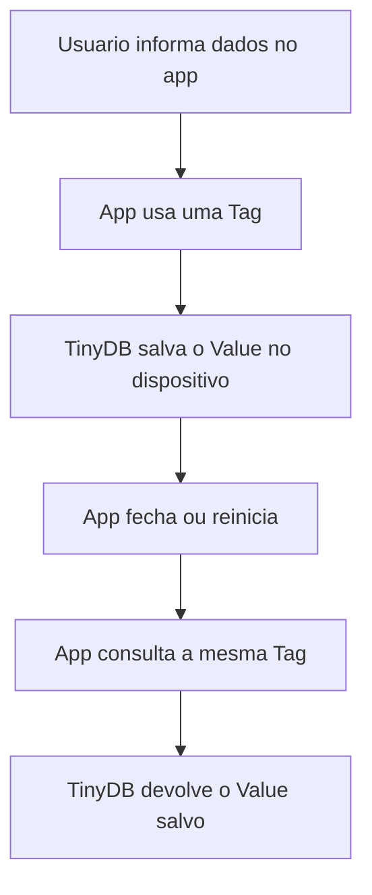

# Pesquisa - App Inventor e TinyDB

**Integrantes:** Laura Cristina Gonçalves da Cruz, Otávio Giovanelli Biazzi, Pedro Henrique Miranda e Pedro Henrique Dalle Molle Godoi
**Série:** 2D  
**Curso:** Técnico em Informática Para Internet  
**Tema:** App Inventor: manipulação de banco de dados no dispositivo com TinyDB

## 1. O que é o MIT App Inventor?

O MIT App Inventor é uma plataforma gratuita de desenvolvimento de aplicativos, criada para permitir que pessoas iniciantes construam apps por meio de programação visual em blocos. Em vez de escrever todo o código manualmente, o usuário monta a interface do aplicativo e depois conecta blocos lógicos que representam ações, eventos, variáveis e comandos (MIT APP INVENTOR, 2025).

Ele é utilizado principalmente para criar aplicativos Android, fazer protótipos, aprender lógica de programação e desenvolver projetos educacionais. Por ser visual, o App Inventor facilita o entendimento da relação entre interface e comportamento do programa, algo importante para quem ainda está começando em programação.

Entre suas principais vantagens para iniciantes estão:

- ambiente visual, com menos necessidade de digitar código;
- blocos de programação que ajudam a evitar erros de sintaxe;
- possibilidade de testar o aplicativo no celular;
- foco em lógica, eventos e componentes;
- uso em projetos escolares e protótipos rápidos;
- documentação oficial com exemplos e componentes prontos.

Segundo materiais educacionais brasileiros sobre App Inventor, como os do IFSC, a ferramenta é adequada para introduzir conceitos de programação por meio da criação de aplicativos móveis e interação com componentes visuais (IFSC, 2012a). Esse tipo de abordagem também aparece em propostas educacionais brasileiras voltadas ao ensino de pensamento computacional e desenvolvimento de apps (THOMAS; CAMBRAIA, 2023).

## 2. O que é o TinyDB?

O TinyDB é um componente de armazenamento do MIT App Inventor. Ele serve para salvar dados diretamente no dispositivo em que o aplicativo está instalado, permitindo que essas informações continuem disponíveis mesmo depois que o app é fechado e aberto novamente (MIT APP INVENTOR, 2024a).

Sua finalidade é guardar informações simples do aplicativo, como nomes, listas, configurações, pontuações, cadastros pequenos e preferências do usuário. Os dados são armazenados localmente no próprio aparelho, e não em um servidor na Internet.

O funcionamento do TinyDB é baseado em pares de **Tag** e **Value**:

- **Tag:** nome usado como chave para identificar uma informação;
- **Value:** valor salvo naquela chave, podendo ser texto, número, lista ou outro dado aceito pelo App Inventor.

### Vantagens

- funciona sem Internet;
- é simples de usar;
- mantém os dados salvos no dispositivo;
- é útil para aplicativos pequenos e médios;
- permite salvar listas e valores com poucos blocos.

### Limitações

- os dados ficam apenas no dispositivo;
- não é indicado para compartilhamento de dados entre vários usuários;
- se o aplicativo for removido ou os dados forem apagados, as informações podem ser perdidas;
- não substitui um banco de dados completo;
- exige cuidado na organização das Tags para evitar confusão.

## 3. Funcionamento do TinyDB

O TinyDB trabalha como um pequeno banco de dados local dentro do aplicativo. Para salvar uma informação, o programador escolhe uma Tag e associa a ela um valor. Depois, para recuperar essa informação, usa a mesma Tag. Se o valor de uma Tag for gravado novamente, o valor antigo é substituído pelo novo.



### Tags ou chaves

As Tags funcionam como nomes de identificação. Por exemplo, em um aplicativo de tarefas, a Tag `lista_tarefas` pode guardar todas as tarefas cadastradas pelo usuário.

Exemplo:

```text
Tag: lista_tarefas
Value: ["Estudar TinyDB", "Fazer atividade", "Enviar no Teams"]
```

### Valores

O Value é o conteúdo salvo na Tag. Ele pode ser um texto, número, lista ou outro tipo de dado simples. Por exemplo:

```text
Tag: nome_usuario
Value: "Otavio"
```

```text
Tag: pontuacao
Value: 150
```
