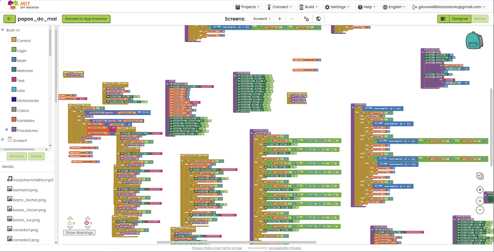

# Relatório – Papas do Mal

## Instituição

`ETEC Vasco Antônio Venchiarutti`

## Curso

`Informática para Internet`

## Disciplina

`DDM – Desenvolvimento para Dispositivos Móveis`

## Turma

`2ºD`

## Integrantes

- `Otávio Giovanelli Biazzi`
- `Pedro Henrique Miranda`
- `Laura Cristina Gonçalves da Cruz`
- `Pedro Henrique Dalle Molle Godoi`

---

# Apresentação do jogo

**Papas do Mal** é um jogo autoral de sobrevivência e suspense desenvolvido no MIT App Inventor. O jogador permanece em um escritório durante a noite e precisa acompanhar a movimentação de três personagens pelo estabelecimento.

## Objetivo

O objetivo é sobreviver da meia-noite até as 6 horas da manhã. Para isso, o jogador deve observar as câmeras, acompanhar a posição dos inimigos e utilizar a porta e a lanterna no momento correto.

O projeto foi pensado para aplicar os conhecimentos adquiridos nos jogos do estudo de caso, principalmente o uso de Canvas, sprites, eventos, variáveis, procedimentos, sons e temporizadores.

## Estrutura inicial

A primeira versão definiu o menu, a tela principal e o começo do fluxo da partida. Também foram organizadas as variáveis que representam o horário, os estados da câmera, da porta e da lanterna, além da posição dos personagens.

---

# Interface e identidade visual

O jogo utiliza a orientação horizontal para aproveitar melhor o espaço da tela. A interface principal simula o ponto de vista do jogador dentro do escritório, enquanto o sistema de câmeras permite observar diferentes ambientes.

Os cenários incluem salão, palco, corredores, banheiro, cozinha e escritório. Cada local possui uma imagem de fundo própria, e os personagens são representados por sprites que aparecem conforme suas posições são atualizadas.

Na tela inicial, o botão `INICIAR` começa a sequência de introdução. Durante a partida, o jogador pode abrir o mapa das câmeras, escolher um ambiente, fechar o monitor, ir até a porta e voltar ao escritório.

## Organização dos controles

- botões posicionados sobre o mapa para selecionar as câmeras;
- controle para abrir e fechar o monitor;
- botão para ir até a porta;
- botão de retorno ao escritório;
- controle para abrir ou fechar a porta;
- lanterna para verificar se existe algum inimigo próximo.

## Print da interface

---

# Mecânicas do jogo

## Sistema de horário

A noite começa às `12 AM` e termina às `6 AM`. O procedimento `desenhar_horario` mostra o horário no Canvas, enquanto os temporizadores controlam a passagem do tempo. Ao alcançar 6 AM, a partida é encerrada com a sequência de vitória.

## Câmeras

A variável `camera` identifica o ambiente selecionado, e `camera_aberta` informa se o monitor está em uso. Ao tocar nos pontos do mapa, o fundo muda para o cenário correspondente e o procedimento `mostrar_inimigos` exibe somente os personagens presentes naquela câmera.

Esse sistema permite acompanhar Papas, Rato e Vaca antes que eles se aproximem do escritório.

## Movimentação dos inimigos

Os procedimentos `papas_mover`, `rato_mover` e `vaca_mover` controlam o avanço de cada personagem. O `Clock_IA` executa as decisões em intervalos definidos e utiliza valores aleatórios para variar a movimentação.

As posições são mantidas em variáveis globais. Conforme um inimigo avança, ele aparece em lugares diferentes, como palco, salão, corredores, banheiro ou porta.

## Porta e lanterna

Na área da porta, o jogador pode acender a luz para verificar se existe um inimigo próximo. Também pode fechar a porta para impedir a entrada. Os estados são armazenados nas variáveis `lanterna` e `porta_fechada`.

Se um personagem permanecer na porta e ela continuar aberta, o temporizador de jumpscare pode encerrar a partida. Fechar a porta no momento correto faz o inimigo recuar e permite continuar a noite.

## Sons e transições

O projeto utiliza música de menu, narração introdutória, som de vitória e imagens de jumpscare. Os efeitos de transição são controlados com sprites de fade e pelo procedimento `atualizar_fade`, que altera gradualmente a imagem exibida.

## Print dos blocos

