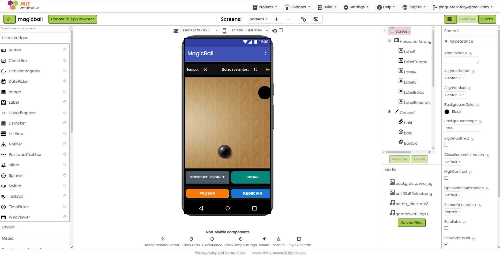
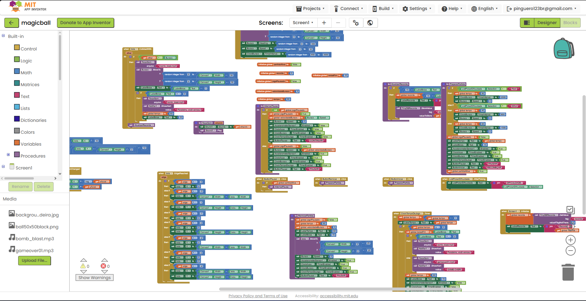
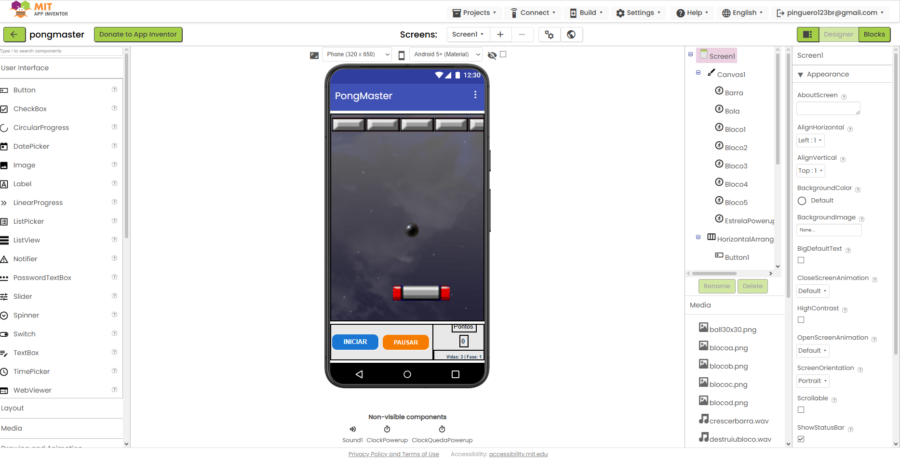
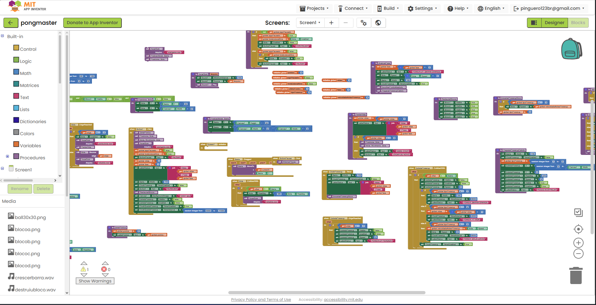

# Relatório – Desenvolvimento de Jogos no MIT App Inventor

## Instituição

`ETEC Vasco Antônio Venchiarutti`

## Curso

`Informática para Internet`

## Disciplina

`DDM – Desenvolvimento para Dispositivos Móveis`

## Turma

`2ºD`

## Autores

- `Otávio Giovanelli Biazzi`
- `Pedro Henrique Miranda`

---

## Objetivo

O objetivo da atividade foi estudar e melhorar jogos feitos no MIT App Inventor. Durante o desenvolvimento, trabalhamos com componentes visuais, eventos, variáveis, procedimentos, sons, colisões, temporizadores e sensores do celular.

Cada projeto explora uma mecânica diferente. Isso permitiu observar como os mesmos recursos do App Inventor podem ser combinados para criar formas variadas de interação.

---

# Projeto 1 – Carrinhos com acelerômetro

## Objetivo e funcionamento

O projeto `AcelerometroXYZ.aia` transforma a inclinação do celular em controle para um carrinho. O usuário escolhe entre Fusca, carro de rali e Fórmula 1, e cada veículo utiliza uma sensibilidade diferente.

O evento `AccelerationChanged` lê os valores dos eixos X e Y. Esses valores são usados para definir a direção e atualizar a posição do `ImageSprite` dentro do Canvas. Quando o carrinho chega a uma borda, ele reaparece do lado oposto, mantendo o movimento contínuo.

Também utilizamos o evento `Shaking`: ao chacoalhar o aparelho, o fundo recebe uma cor aleatória. Dessa forma, o projeto demonstra duas possibilidades do acelerômetro em uma mesma aplicação.

## Melhorias realizadas

- seleção entre três veículos;
- sensibilidades diferentes para cada escolha;
- instruções na parte superior da tela;
- troca aleatória da cor do fundo ao chacoalhar;
- reposicionamento do carrinho ao alcançar as bordas.

## Prints do projeto

---

# Projeto 2 – Bilhar

## Objetivo e funcionamento

O projeto `bilhar.aia` simula uma mesa de bilhar. O jogador lança a bola branca com um gesto sobre a tela. O evento `Flung` aproveita a velocidade e a direção do gesto para movimentar a bola.

Um temporizador reduz a velocidade aos poucos, criando um efeito de atrito. A bola rebate nas bordas do Canvas e, quando colide com uma das seis caçapas, toca um som, volta ao centro, para o movimento e acrescenta um ponto ao placar desenhado na própria mesa.

O projeto também permite reiniciar a bola e zerar a pontuação tocando na região inferior da mesa quando ela está parada.

## Melhorias realizadas

- imagem de fundo representando uma mesa de bilhar;
- seis caçapas distribuídas pelas bordas;
- controle do lançamento por gesto;
- redução gradual da velocidade;
- som e pontuação ao acertar uma caçapa;
- reposicionamento da bola após o ponto.

## Prints do projeto

---

# Projeto 3 – MagicBall

## Objetivo e funcionamento

No `magicball.aia`, o jogador inclina o celular para conduzir a bola até um buraco que muda de posição e se movimenta pelo Canvas. O objetivo é acertar todas as 15 bolas antes que o tempo termine.

O acelerômetro controla a posição da bola usando os valores dos eixos X e Y. Quando a bola colide com o buraco, o jogo toca um efeito sonoro, reduz o contador de bolas restantes e move o alvo para outra posição. Um temporizador controla os 60 segundos da partida e encerra o jogo quando o tempo chega a zero.

O seletor de dificuldade modifica o tempo disponível, a velocidade do buraco e o intervalo de movimentação. O modo fácil oferece mais tempo e um alvo mais lento, enquanto o difícil aumenta a velocidade e reduz o tempo da partida.

## Recursos adicionados

- dificuldades fácil, normal e difícil;
- contador de tempo e de bolas restantes;
- botões para iniciar, pausar e reiniciar;
- movimentação pelo acelerômetro;
- alvo com posição, direção e velocidade variáveis;
- mensagens de vitória e fim de jogo;
- efeitos sonoros;
- recorde salvo localmente com TinyDB.

O recorde é recuperado quando a tela inicia e atualizado ao final da partida. Assim, o jogador consegue comparar o resultado atual com o melhor desempenho salvo no aparelho.

## Prints do projeto

---

# Projeto 4 – PongMaster

## Objetivo e funcionamento

O `PongMaster.aia` segue o estilo Brick Breaker. O jogador arrasta a barra horizontal para rebater a bola e destruir os cinco blocos posicionados na parte superior do Canvas.

O jogo controla pontos, vidas e fases. Quando a bola toca em um bloco, ela rebate, o bloco é ocultado, o placar aumenta e um som é reproduzido. Depois que todos os blocos são destruídos, eles reaparecem e o jogador avança para a fase seguinte, com aumento da velocidade da bola e troca do fundo.

Quando a bola cai, o procedimento de perda de vida reduz o contador. Se ainda houver vidas, a bola e a barra voltam às posições iniciais. Quando as vidas acabam, o jogo mostra `GAME OVER` e oferece a opção de iniciar novamente.

## Sistema de power-ups

Durante a partida, uma estrela pode aparecer e cair pelo cenário. Ao ser coletada pela barra, ela escolhe aleatoriamente um dos seguintes benefícios:

- aumento temporário do tamanho da barra;
- acréscimo de uma vida;
- redução temporária da velocidade da bola.

Se a estrela chegar ao fim da tela sem ser coletada, o jogo informa que o power-up foi perdido. Os temporizadores controlam tanto a queda quanto a duração dos efeitos.

## Recursos adicionados

- controle da barra por arraste;
- placar, vidas e fases;
- cinco blocos com detecção de colisão;
- fundos diferentes escolhidos entre as fases;
- botão de pausa e continuação;
- sons de início, rebatida, bloco destruído e perda de vida;
- três tipos de power-up;
- reinício completo após o fim da partida.

## Prints do projeto

---

# Comparação dos projetos

| Projeto | Principal interação | Recursos trabalhados |
| --- | --- | --- |
| Carrinhos | Inclinação e movimento do celular | Acelerômetro, Sprite, Canvas e cores. |
| Bilhar | Gesto de lançamento | Impulso, atrito, colisão, som e pontuação. |
| MagicBall | Inclinação para alcançar o alvo | Acelerômetro, tempo, dificuldade, pausa e TinyDB. |
| PongMaster | Arraste da barra e colisões | Fases, vidas, sons, blocos e power-ups. |

## Considerações finais

Os quatro projetos mostraram que um jogo mobile depende da integração entre interface, regras e resposta aos comandos do jogador. Também percebemos a importância de separar a lógica em procedimentos, usar nomes claros e testar situações como pausa, reinício, colisões e fim de jogo.

As melhorias não ficaram somente na aparência. Foram acrescentados recursos que mudam a jogabilidade, como níveis de dificuldade, recorde persistente, fases, vidas, power-ups, controle por gesto e diferentes usos do acelerômetro.

---

*Relatório desenvolvido para fins educacionais na disciplina de Desenvolvimento para Dispositivos Móveis.*
