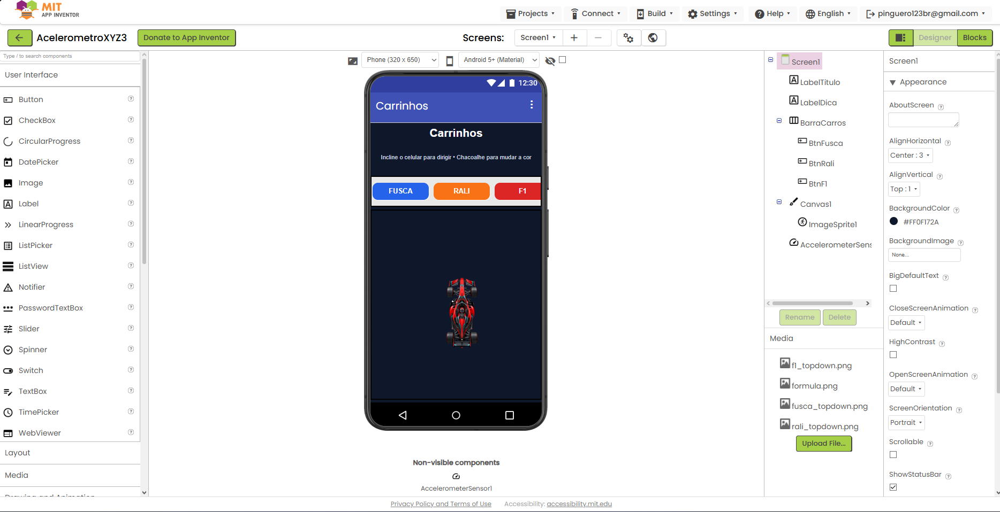
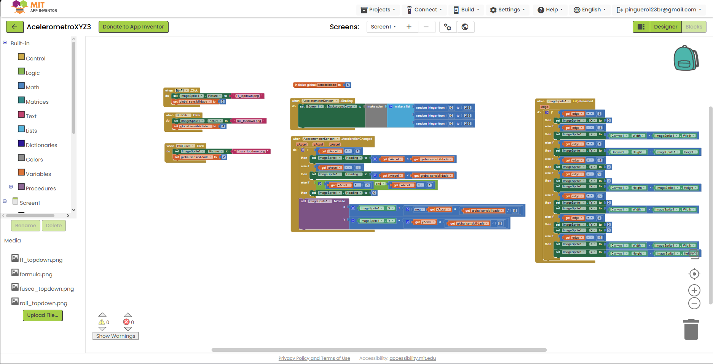
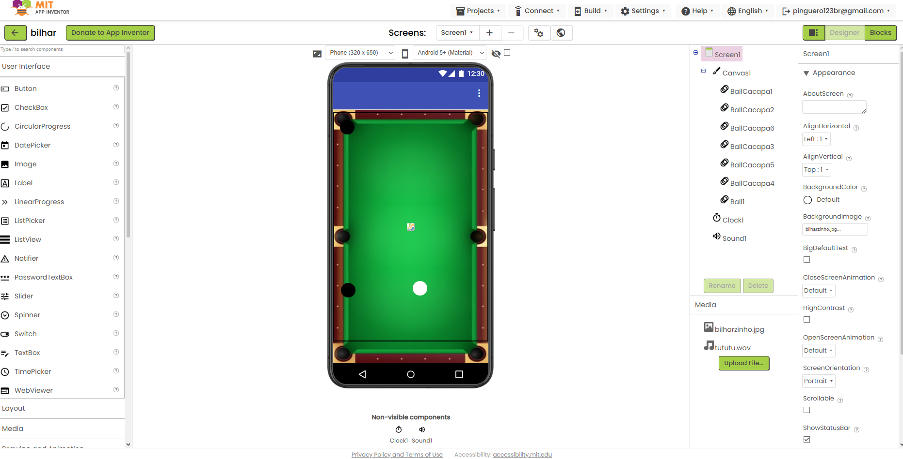
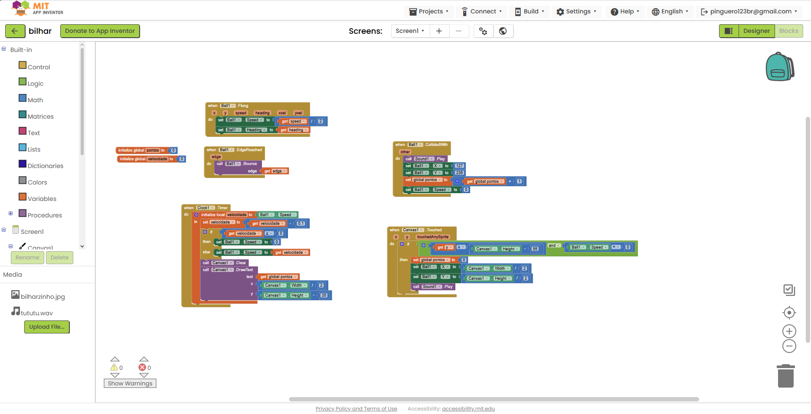

# Relatório – Desenvolvimento de Jogos no MIT App Inventor

## Instituição

`ETEC Vasco Antônio Venchiarutti`

## Curso

`Informática para Internet`

## Disciplina

`DDM – Desenvolvimento para Dispositivos Móveis`

## Turma

`2ºD`

## Autores

- `Otávio Giovanelli Biazzi`
- `Pedro Henrique Miranda`

---

## Objetivo

O objetivo da atividade foi estudar e melhorar jogos feitos no MIT App Inventor. Durante o desenvolvimento, trabalhamos com componentes visuais, eventos, variáveis, procedimentos, sons, colisões, temporizadores e sensores do celular.

Cada projeto explora uma mecânica diferente. Isso permitiu observar como os mesmos recursos do App Inventor podem ser combinados para criar formas variadas de interação.

---

# Projeto 1 – Carrinhos com acelerômetro

## Objetivo e funcionamento

O projeto `AcelerometroXYZ.aia` transforma a inclinação do celular em controle para um carrinho. O usuário escolhe entre Fusca, carro de rali e Fórmula 1, e cada veículo utiliza uma sensibilidade diferente.

O evento `AccelerationChanged` lê os valores dos eixos X e Y. Esses valores são usados para definir a direção e atualizar a posição do `ImageSprite` dentro do Canvas. Quando o carrinho chega a uma borda, ele reaparece do lado oposto, mantendo o movimento contínuo.

Também utilizamos o evento `Shaking`: ao chacoalhar o aparelho, o fundo recebe uma cor aleatória. Dessa forma, o projeto demonstra duas possibilidades do acelerômetro em uma mesma aplicação.

## Melhorias realizadas

- seleção entre três veículos;
- sensibilidades diferentes para cada escolha;
- instruções na parte superior da tela;
- troca aleatória da cor do fundo ao chacoalhar;
- reposicionamento do carrinho ao alcançar as bordas.

## Prints do projeto

---

# Projeto 2 – Bilhar

## Objetivo e funcionamento

O projeto `bilhar.aia` simula uma mesa de bilhar. O jogador lança a bola branca com um gesto sobre a tela. O evento `Flung` aproveita a velocidade e a direção do gesto para movimentar a bola.

Um temporizador reduz a velocidade aos poucos, criando um efeito de atrito. A bola rebate nas bordas do Canvas e, quando colide com uma das seis caçapas, toca um som, volta ao centro, para o movimento e acrescenta um ponto ao placar desenhado na própria mesa.

O projeto também permite reiniciar a bola e zerar a pontuação tocando na região inferior da mesa quando ela está parada.

## Melhorias realizadas

- imagem de fundo representando uma mesa de bilhar;
- seis caçapas distribuídas pelas bordas;
- controle do lançamento por gesto;
- redução gradual da velocidade;
- som e pontuação ao acertar uma caçapa;
- reposicionamento da bola após o ponto.

## Prints do projeto

