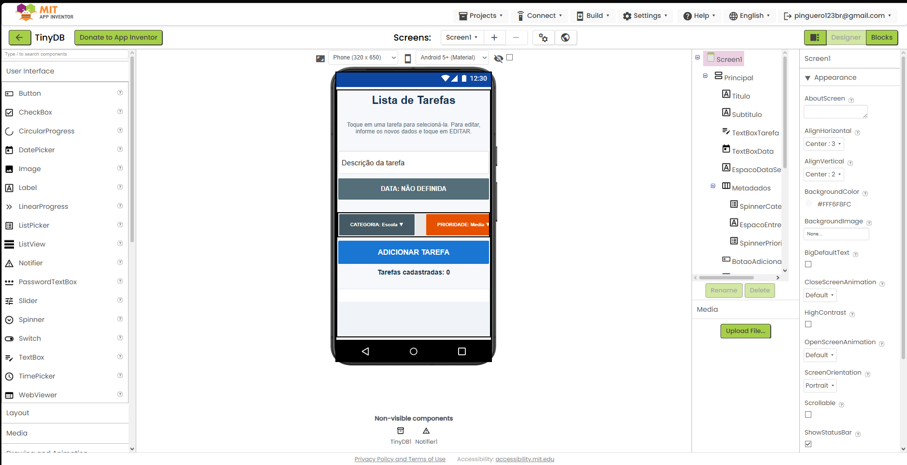

# Relatório – Lista de Tarefas com TinyDB

## Instituição

`ETEC Vasco Antônio Venchiarutti`

## Curso

`Informática para Internet`

## Disciplina

`DDM – Desenvolvimento para Dispositivos Móveis`

## Turma

`2ºD`

## Integrantes

- `Otávio Giovanelli Biazzi`
- `Pedro Henrique Miranda`
- `Laura Cristina Gonçalves da Cruz`
- `Pedro Henrique Dalle Molle Godoi`

---

# Aplicativo de lista de tarefas

## Objetivo

O objetivo do projeto foi desenvolver, no MIT App Inventor, um aplicativo que permita cadastrar e organizar tarefas no celular. As informações precisam continuar disponíveis depois que o aplicativo é fechado, por isso utilizamos o componente **TinyDB** como armazenamento local.

## Interface do aplicativo

A tela principal foi organizada para reunir as informações necessárias sem obrigar o usuário a navegar por várias páginas. Ela possui:

- campo para a descrição da tarefa;
- seletor de data;
- seleção de categoria;
- seleção de prioridade;
- botão para adicionar a tarefa;
- contador de tarefas cadastradas;
- lista com os registros salvos;
- botões para editar, concluir e excluir;
- opção para apagar toda a lista;
- tela com informações sobre o projeto.

## Print da interface

