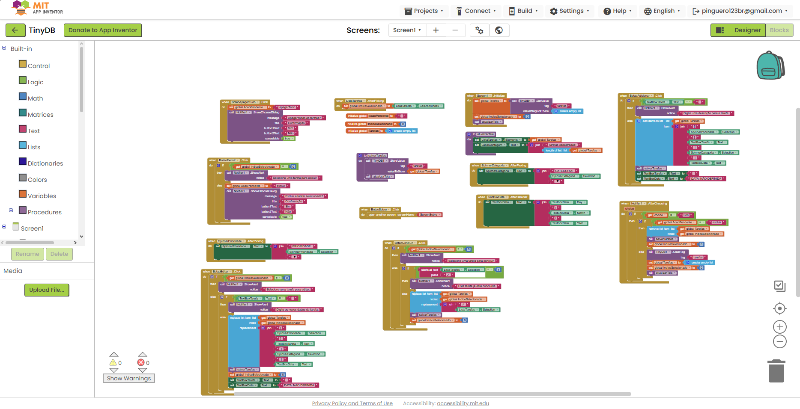

# Relatório – Lista de Tarefas com TinyDB

## Instituição

`ETEC Vasco Antônio Venchiarutti`

## Curso

`Informática para Internet`

## Disciplina

`DDM – Desenvolvimento para Dispositivos Móveis`

## Turma

`2ºD`

## Integrantes

- `Otávio Giovanelli Biazzi`
- `Pedro Henrique Miranda`
- `Laura Cristina Gonçalves da Cruz`
- `Pedro Henrique Dalle Molle Godoi`

---

# Aplicativo de lista de tarefas

## Objetivo

O objetivo do projeto foi desenvolver, no MIT App Inventor, um aplicativo que permita cadastrar e organizar tarefas no celular. As informações precisam continuar disponíveis depois que o aplicativo é fechado, por isso utilizamos o componente **TinyDB** como armazenamento local.

## Interface do aplicativo

A tela principal foi organizada para reunir as informações necessárias sem obrigar o usuário a navegar por várias páginas. Ela possui:

- campo para a descrição da tarefa;
- seletor de data;
- seleção de categoria;
- seleção de prioridade;
- botão para adicionar a tarefa;
- contador de tarefas cadastradas;
- lista com os registros salvos;
- botões para editar, concluir e excluir;
- opção para apagar toda a lista;
- tela com informações sobre o projeto.

## Print da interface

---

## Armazenamento com TinyDB

As tarefas são mantidas em uma lista global e gravadas no TinyDB com a tag `tarefas`. Criamos o procedimento `salvarTarefas` para centralizar a gravação e evitar repetir os mesmos blocos em todas as ações.

Quando a tela é iniciada, o aplicativo usa `GetValue` para procurar a tag. Se ainda não houver dados, ele recebe uma lista vazia como valor padrão. Em seguida, o procedimento `atualizarTela` envia a lista para o componente visual e atualiza a quantidade de tarefas cadastradas.

Esse funcionamento permite fechar o aplicativo e abri-lo novamente sem perder os registros, pois o conteúdo não fica somente em uma variável temporária.

## Cadastro e validação

Antes de adicionar uma tarefa, o aplicativo verifica se a descrição foi preenchida. Quando o campo está vazio, uma mensagem orienta o usuário. Quando os dados estão corretos, o programa reúne prioridade, descrição, categoria e data em um único item, adiciona o item à lista e salva a alteração no TinyDB.

O seletor de data monta o texto com dia, mês e ano. Os seletores de categoria e prioridade ajudam a deixar cada tarefa mais organizada.

## Edição, conclusão e exclusão

Ao tocar em uma tarefa, o aplicativo guarda seu índice. A partir dessa seleção, o usuário pode:

- editar os dados e substituir o item na mesma posição da lista;
- marcar a tarefa como concluída, acrescentando o símbolo `✓`;
- excluir somente a tarefa selecionada, após uma confirmação;
- apagar todas as tarefas, também após uma confirmação.

As mensagens do componente `Notifier` evitam operações acidentais e informam quando nenhuma tarefa foi selecionada. Depois de cada alteração, a lista é salva novamente e a interface é atualizada.

## Principais componentes utilizados

| Componente | Utilização no projeto |
| --- | --- |
| `TinyDB` | Salvar e recuperar a lista de tarefas no dispositivo. |
| `ListView` | Exibir as tarefas e permitir a seleção de um item. |
| `TextBox` | Receber a descrição da tarefa. |
| `DatePicker` | Escolher a data relacionada à tarefa. |
| `ListPicker` | Selecionar categoria e prioridade. |
| `Notifier` | Mostrar avisos e caixas de confirmação. |
| `Button` | Executar cadastro, edição, conclusão e exclusão. |

## Print dos blocos

---

## Considerações finais

O projeto permitiu aplicar o armazenamento persistente em uma situação prática. Além de cadastrar tarefas, trabalhamos com listas, seleção por índice, validação de campos, edição, exclusão e confirmação de ações.

Com o TinyDB, entendemos a diferença entre manter um valor apenas durante a execução e salvá-lo de forma permanente no dispositivo. O resultado é um aplicativo simples, mas completo para o objetivo proposto.

---

*Relatório desenvolvido para fins educacionais na disciplina de Desenvolvimento para Dispositivos Móveis.*
